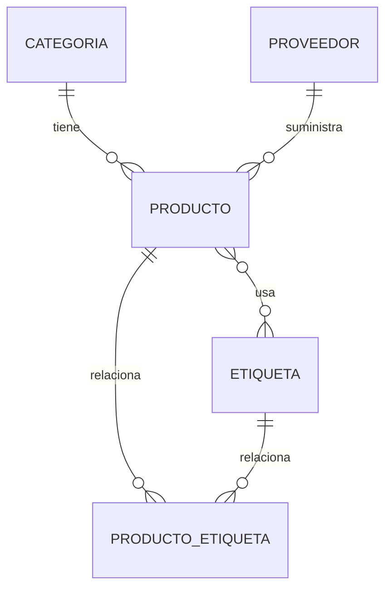

# Gestión de productos

## Descripción

La aplicación es una API REST hecha con Spring Boot para administrar categorías,
productos, proveedores y etiquetas. Usa PostgreSQL, Spring Data JPA, Hibernate y
Flyway.

## Estructura

```text
ni.edu.uam.gestionproductos
├── controller
├── dto
├── entity
├── repository
└── service
```

Los controladores reciben las peticiones HTTP. Los servicios contienen la lógica
de la aplicación. Los repositorios trabajan con la base de datos. Las entidades
representan las tablas y el DTO define los datos recibidos para un producto.

## ProductoService y DTO

`ProductoService` realiza el listado, búsqueda, registro, actualización,
eliminación, consulta por categoría y asociación de etiquetas. El controlador
usa el servicio y ya no accede directamente a `ProductoRepository`.

`ProductoRequestDTO` recibe estos datos:

```json
{
  "codigo": "TEC-001",
  "nombre": "Teclado mecánico",
  "descripcion": "Teclado para oficina",
  "precioVenta": 75.50,
  "existencia": 20,
  "categoriaId": 2,
  "proveedorId": 1,
  "etiquetaIds": [1, 2]
}
```

Enviar `categoriaId` es más sencillo y seguro que enviar una entidad `Categoria`
completa. El Service busca la categoría y establece la relación.

## Endpoints principales

### Productos

```text
GET    /api/productos
GET    /api/productos/{id}
POST   /api/productos
PUT    /api/productos/{id}
DELETE /api/productos/{id}
GET    /api/productos/categoria/{categoriaId}
POST   /api/productos/{productoId}/etiquetas/{etiquetaId}
```

El DELETE responde `204 No Content`.

### Categorías y proveedores

```text
GET  /api/categorias
POST /api/categorias
GET  /api/proveedores
POST /api/proveedores
```

### Etiquetas

```text
GET  /api/etiquetas
POST /api/etiquetas
```

Ejemplo para crear una etiqueta:

```json
{
  "nombre": "Oferta"
}
```

La guía propone crear: Oferta, Importado, Empresarial, Portátil y Gaming.

## Relaciones



`categoria_id` está en la tabla `producto`, por eso Producto es el lado que
contiene la clave foránea. `producto_etiqueta` es necesaria porque una relación
Muchos a Muchos necesita guardar las claves de ambos lados.

La relación categoría-producto es bidireccional con `@ManyToOne` y
`@OneToMany`. La lista inversa se ignora al generar JSON para evitar ciclos.

## Migraciones

- V1 crea `categoria` y `producto`.
- V2 agrega `descripcion` a `producto`.
- V3 crea `proveedor` y su relación con `producto`.
- V4 crea `etiqueta` y `producto_etiqueta`.
- V5 agrega la restricción de nombre único para las etiquetas, porque V4 ya había sido aplicada.

Las migraciones son cambios ordenados de la base de datos. No se deben editar
después de aplicarse.

## Respuestas de comprobación

1. `Service`: contiene la lógica de negocio.
2. El controlador debe encargarse de HTTP y no mezclar todas las reglas con la persistencia.
3. Un DTO es un objeto para transportar datos entre el cliente y la API.
4. La entidad representa una tabla; el DTO representa los datos de una petición.
5. `categoriaId` evita recibir un objeto completo y permite validar la relación en el Service.
6. `@OneToMany` es uno a muchos y `@ManyToOne` es muchos a uno.
7. La clave foránea está en `producto.categoria_id`.
8. `@ManyToMany` representa muchos productos con muchas etiquetas.
9. `@JoinTable` configura la tabla intermedia de la relación.
10. `producto_etiqueta` guarda las dos claves foráneas de la relación N:N.
11. El Repository realiza el acceso a datos mediante Spring Data JPA.
12. El flujo es: Cliente → Controller → Service → Repository → PostgreSQL.

## Configuración y pruebas

La conexión está en `src/main/resources/application.properties` y utiliza la
base `gestion_productos`. Hibernate usa `ddl-auto=validate`, por lo que valida
el esquema pero no crea ni modifica tablas. Flyway administra las migraciones.

Comandos:

```powershell
.\mvnw.cmd test
.\mvnw.cmd verify
```

La prueba realizada con PostgreSQL local terminó correctamente. Flyway validó
las migraciones y la aplicación respondió las consultas de categorías,
productos, etiquetas y productos por categoría. También se probó la creación
de un producto y la asociación de etiquetas.

## Capturas pendientes

- Estructura de paquetes.
- `ProductoService` y `ProductoRequestDTO`.
- GET, POST, PUT y DELETE de productos en Postman.
- Consulta de productos por categoría.
- V4 y la tabla `producto_etiqueta` en PostgreSQL.
- Entidad y repositorio `Etiqueta`.
- Asociación de etiquetas mediante Postman.
- Tabla `flyway_schema_history`.

## Conclusión

Se organizó la API usando Controller, Service y Repository. Se agregó un DTO
para recibir los datos de los productos y se completó su CRUD. También se
implementó la consulta por categoría y la relación Muchos a Muchos entre
productos y etiquetas. PostgreSQL guarda la información y Flyway controla las
migraciones. Finalmente, los endpoints fueron probados con la aplicación
conectada a la base de datos local.
